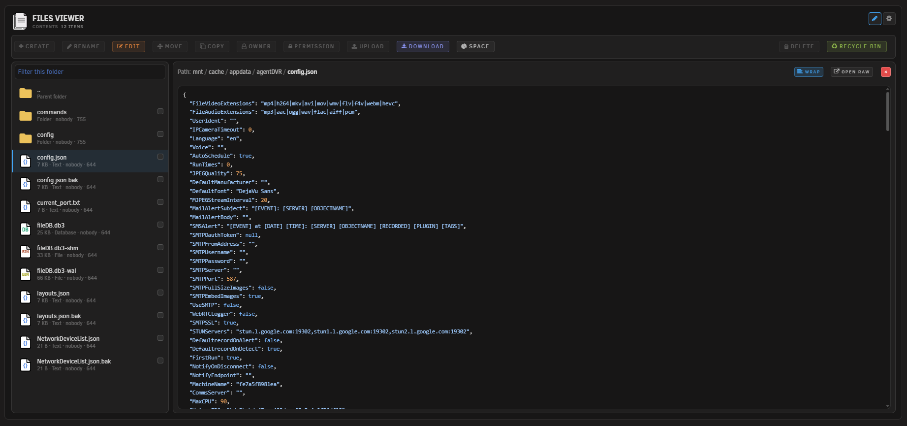
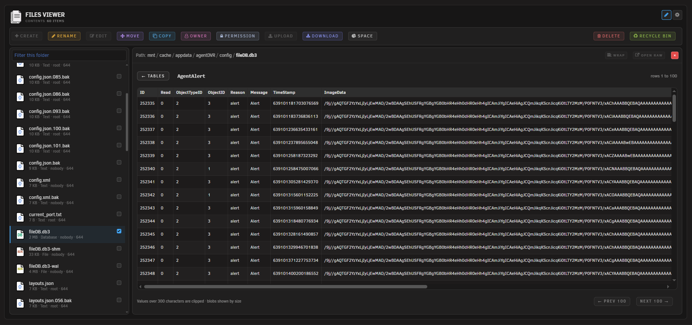
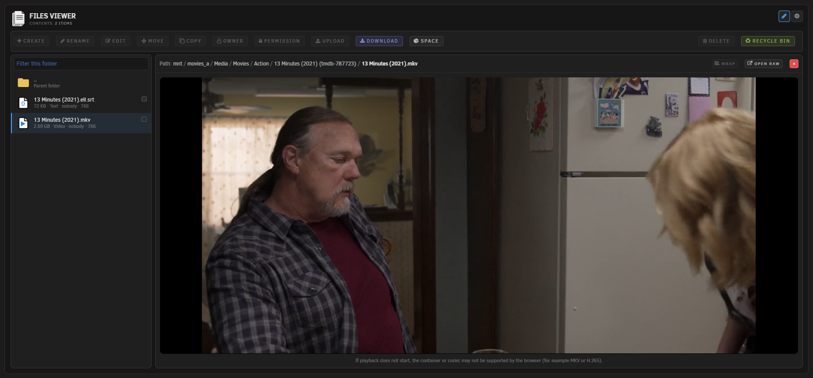
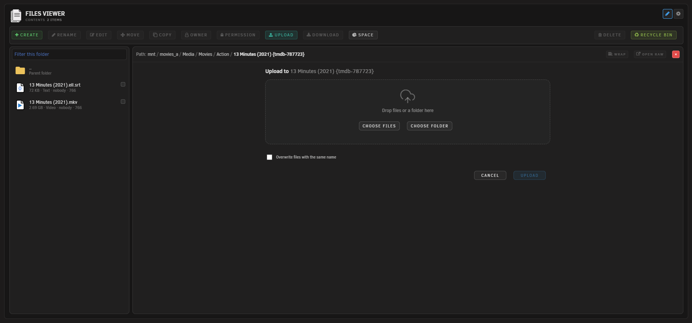
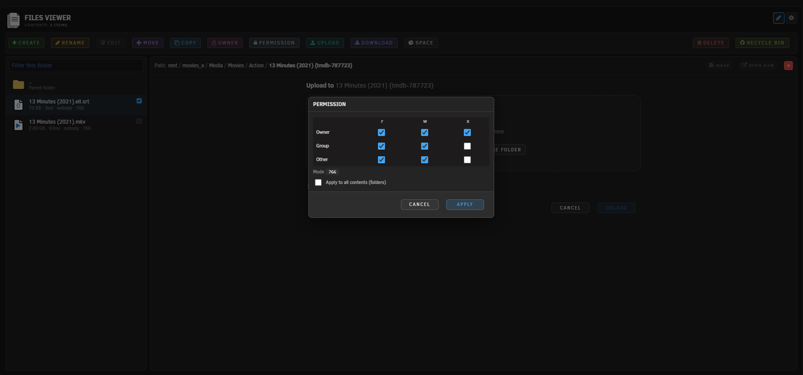
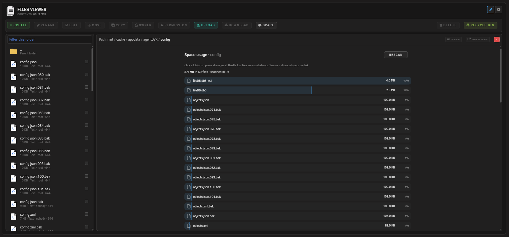
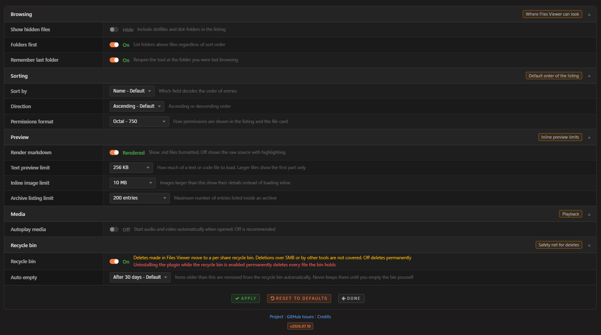

# Files Viewer for Unraid

Browse your Unraid shares and disks from a page under Tools, preview files in place, and manage them without leaving the browser. Deletes land in a per-share recycle bin instead of vanishing.

<p align="center">
  &nbsp;
  &nbsp;
  &nbsp;
  &nbsp;
  
</p>

## What it does

Unraid's built-in File Manager is great for moving files around, but it shows "Unsupported Preview" for most file types. Files Viewer started as its read-only companion and grew into a manager of its own: a two-pane page under Tools where you browse on the left, see what is selected on the right, and act on it from the bar above.

It previews the common types in place: images, text and code with syntax highlighting, Markdown, audio and video, and PDF, and it lists the contents of zip and tar archives. Richer formats open too: SQLite databases, Word documents, spreadsheets, CSV as a table, fonts, and e-books. On the writing side it covers the everyday jobs: create, rename, edit, move, copy, upload, download, ownership, permissions, and delete.

## Features

- Tools Page: A full-page two-pane browser under Tools > Files Viewer, with a folder list on the left and a preview pane on the right
- Rooted at /mnt: Browsing starts at /mnt and stays inside it, so every disk, pool, and share is reachable in one place and nothing above /mnt is
- Write operations: Create files and folders, rename, move, copy, delete, and change owner or permissions from the top bar
- In-place editor: Open text and config files up to 2 MB in the preview pane, change them, and save them back
- Upload and download: Send files from your machine to the current folder, cancel midway if you change your mind, and pull any file back out
- Background jobs: Long copies, moves, and deletes run in a worker with live progress and a cancel button, so the page never hangs
- Recycle bin: Deletes made in Files Viewer move to a per-share bin, with restore and purge in a bin view and a daily auto-empty (30 or 60 days, or never)
- Bin off the network: The bin is reachable from this page alone. Samba vetoes the folder on every share and it is root-only on disk, which covers NFS as well
- Space analysis: Rank everything inside a folder by the space it actually takes, with progress while it counts and drill-in on the results
- Audit log: Every write is appended to /var/log/filesviewer.log with the time, the action, and the paths involved
- Image preview: View images inline, fitted or at actual size with drag to pan, up to a configurable size limit
- Text and code preview: Read text and code with syntax highlighting, long lines wrapped by default with a toggle, capped so large files stay responsive
- Markdown preview: Render Markdown formatted, with a toggle to see the raw source
- Audio and video: Play media inline with the browser's own player and byte-range seeking. Formats the browser cannot decode fall back to details
- PDF preview: View PDFs inline in the browser's own viewer, with byte-range loading
- Archive contents: List what is inside zip and tar archives (including tar.gz, tar.bz2, tar.xz) without extracting anything
- Database browser: Open SQLite databases (.db, .db3, .sqlite) read-only, pick a table, and page through the rows 100 at a time
- Document and spreadsheet preview: Render Word documents (.docx) as formatted text, and show spreadsheets (.xlsx, .xls, .ods) as a table with a tab per sheet
- Table view for CSV: Show CSV and TSV as a table by default, with a toggle back to the raw text
- Font preview: View a specimen of a font file (.ttf, .otf, .woff, .woff2) at several sizes
- E-book preview: Read .epub books in place with previous and next
- Light on the page: The richer previews load their viewer only the first time one is needed, and each has its own size limit
- Disk friendly browsing: Listing folders reads directory entries and metadata only, so browsing never wakes a sleeping disk. Opening a file reads its content, which wakes the disk that holds it
- Breadcrumb navigation: Click any part of the path to jump back up, with an Up row inside each folder
- Folder-aware sorting: Sort by name, size, or modified time, ascending or descending, with folders kept first if you want
- Quick filter and keyboard: Type to filter the current folder by name, move with the arrow keys, and open with Enter
- Remembers your place: Reopens at the folder you were last browsing, which you can turn off
- Theme-aware: Inherits the active Unraid theme (light or dark) without override hacks
- Settings Page: Standalone settings at Settings > Files Viewer with browser-native form submission

## Scope and limits

Files Viewer works inside /mnt and nowhere else, reading and writing alike. Every path is resolved and checked on the server before anything happens, and every write is logged. The recycle bin only catches deletes made in Files Viewer; deletions over SMB or by other tools bypass it, and turning the bin off makes deletes permanent. Most rich formats are parsed in the browser from the file's own bytes; SQLite is the exception and is opened read-only on the server. Listing for 7z and rar is not included, since those need extra tools that are not assumed to be present; those files show their details with a download instead. Video that uses a container or codec the browser cannot decode (for example MKV or H.265) also falls back to details.


**Tool page Screenshots**








## Requirements

- Unraid 7.2.0 or later

## Installation

**Via Community Applications (recommended)**
1. Open Community Applications in Unraid
2. Search for Files Viewer
3. Click Install

**Manual Installation**
1. Go to Plugins in Unraid
2. Click Install Plugin
3. Paste the following URL and click Install:
   ```
   https://raw.githubusercontent.com/Lazaros-Chalkidis/unraid-filesviewer/main/filesviewer.plg
   ```

After installing, open Tools > Files Viewer. Tune the behaviour under Settings > Files Viewer.

## Settings

**Settings > Files Viewer**

**Browsing**
- Show hidden files: Include dotfiles and dot-folders in the listing
- Folders first: List folders above files regardless of sort order
- Remember last folder: Reopen the tool at the folder you were last browsing (on by default)

**Sorting**
- Sort by: Name, Size, or Modified
- Direction: Ascending or Descending
- Permissions format: Show permissions as octal (750) or symbolic (drwxr-xr-x)

**Preview**
- Render markdown: Show .md files formatted, or off to show the raw source
- Text preview limit: How much of a text or code file to load (default 2 MB)
- Inline image limit: Images larger than this show their details instead of loading inline (default 50 MB)
- Archive listing limit: Maximum number of entries listed inside an archive (default 1000)

**Media**
- Autoplay media: Start audio and video automatically when opened (off by default)

**Recycle bin**
- Recycle bin: Deletes made in Files Viewer move to a per-share recycle bin; off deletes permanently (on by default)
- Auto empty: Drop items older than 30 or 60 days, or keep everything until you empty the bin yourself

**Settings Screenshot**



## How it works

Files Viewer is a page under Tools backed by a single PHP endpoint. The read actions list a directory and return a file's details; the write actions cover create, rename, save, move, copy, ownership, permissions, upload, delete, and the recycle bin. Every action runs through the same safety gate, and every write is appended to an audit log at /var/log/filesviewer.log.

Every path the plugin is asked to open is resolved with `realpath` and then checked against `/mnt`. The resolved path must sit under `/mnt` or the request is refused. Because `realpath` collapses `..` segments and follows symlinks before the check, this defeats directory traversal and symlinks that point outside `/mnt` in a single step. Null-byte tricks are rejected up front, and the listing is capped so a huge directory cannot stall the browser.

Listing and the details card only ever read: they list entries and read file metadata with `stat`, which does not wake a sleeping disk. The detected type comes from a fixed extension map, never from the file content, and responses are sent with `X-Content-Type-Options: nosniff`. Access is gated by the Unraid session like every other plugin page, with the CSRF token carried on each request.

Images, audio, video, PDF, raw links and downloads are served by a separate streaming endpoint that supports byte ranges, so the browser can seek media and the PDF viewer can load pages on demand, sends the type from the same fixed map with nosniff, and reads the file in chunks so memory stays flat on large files. Archive contents are listed by a list-only command chosen from the file suffix, with the path passed as a single escaped argument, flags that never extract, and a capped number of entries. SVG is only ever shown inside an image element, which neutralises any script it might contain. Text and code are read up to the preview limit and highlighted in the browser, and Markdown is rendered and then sanitised before it is shown. The richer formats (documents, spreadsheets, CSV, fonts, and e-books) are parsed by bundled libraries running in the browser from the file's own bytes; the HTML produced from documents and spreadsheets is sanitised before display, and each type has a size limit so a large file is never pulled fully into the browser. SQLite is the one exception: the server opens the database itself, read-only and immutable so no locks are taken, and returns one page of rows at a time.

Writes are plain filesystem calls with guard rails. A delete is a rename into the share's own `.RecycleBin` folder on the same filesystem, so it is instant at any size and never copies data, and restore renames it back. The bin folder is vetoed in Samba and owned by root, so network clients can neither see nor enter it. Long copies, moves, and deletes run in a detached worker that reports progress and honours cancel, and uploads arrive in chunks into a hidden part file that only takes its real name once the last chunk lands.

Reading a file's content does wake the disk that holds it, so opening a file for preview spins up its disk. Listing and the details card use `stat` only and never wake a disk, so browsing folders stays disk friendly.

## Development

### Requirements
- Unraid 7.2.0 or later (for testing)
- Bash (for the build script)

### Build
```bash
./build.sh                  # release build
./build.sh "" dev           # dev build
./build.sh "" local         # local build (embeds .txz in .plg)
```

### Project structure

```
unraid-filesviewer/
├── source/
│   ├── css/
│   │   ├── tool.css
│   │   └── settings.css
│   ├── js/
│   │   ├── filesviewer-tool.js
│   │   ├── filesviewer-header.js
│   │   └── vendor/
│   ├── include/
│   │   ├── filesviewer_api.php
│   │   ├── filesviewer_serve.php
│   │   ├── filesviewer_worker.php
│   │   └── filesviewer_recycle_cron.php
│   ├── img/
│   ├── scripts/
│   │   └── merge_cfg.sh
│   ├── FilesViewerTool.page
│   ├── FilesViewerSettings.page
│   ├── FilesViewerButton.page
│   ├── filesviewer.cron
│   └── README.md
├── screenshots/
├── build.sh
├── CHANGELOG.md
├── ca_profile.xml
├── filesviewer.xml
└── README.md
```

## Issues and support

- GitHub Issues: https://github.com/Lazaros-Chalkidis/unraid-filesviewer/issues

## Author

**Lazaros Chalkidis** - https://github.com/Lazaros-Chalkidis

## License

Copyright (C) 2026 Files Viewer Unraid Plugin - Lazaros Chalkidis

Licensed under the GNU General Public License v3.0 or later (GPL-3.0-or-later). See the `LICENSE` file for the full text.
